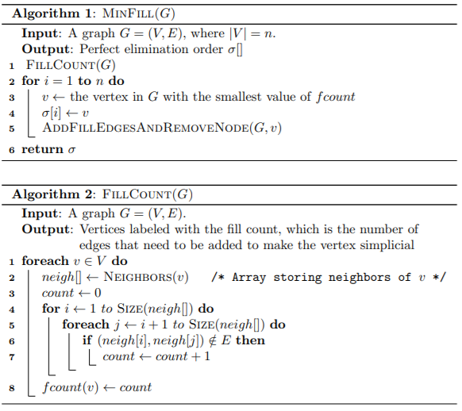
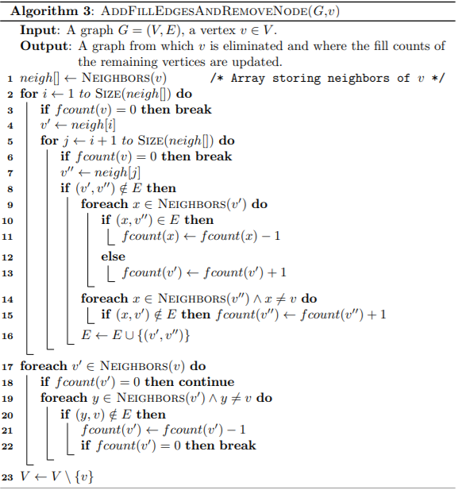
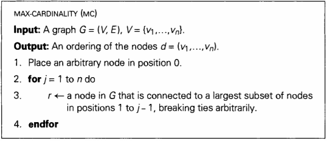
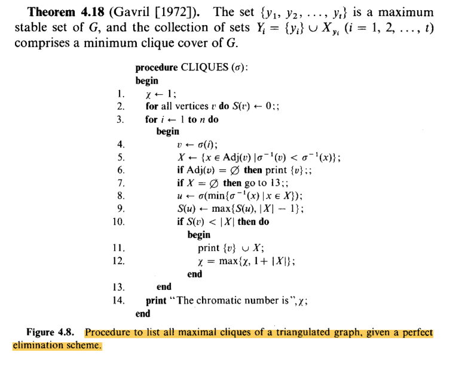
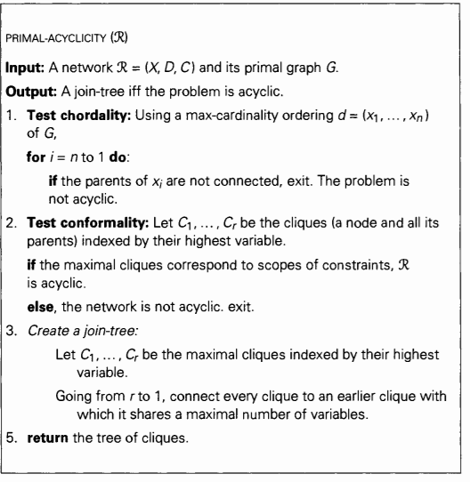

# CSP Solver with Java (CSCE 421)

To read the README.md file in the formatted version: go to this link: https://github.com/tzxb018/csp-solver

## Authors

- **Tomohide Bessho** - _UNL Undergraduate Student_ - https://github.com/tzxb018

## Homework Reports

<details><summary>Final Homework Report (4/28/2020) </summary>

### Overview

For my final project, I chose to create a tree decomposition of the CSP and to determine whether it was necessary to run the max-cardinality algorithm before running the max-clique algorithm. From class, we learned that the trees decomposed from this process can be used to efficiently find the solutions to the CSP in a backtrack-free manner. To create these decompositions, I first need to manifest the CSP into a graph with vertices and edges. To do this, each variable is represented as a vertex in the graph and every binary constraint is represented as an edge. The unary constraints are excluded from this graph, as they would not create an edge in the graph. For every edge, the two vertices of the edge are the two variables in the corresponding scope of the constraint. 

Once this was accomplished, the next task was to implement the min-fill heuristic to triangulate the graph. Not only does the min-fill algorithm put the variables in the perfect elimination ordering (PEO), but it also adds in edges to the graph to make sure that the graph is triangulated in a manner that minimizes the number of edges filled in. 

With the graph triangulated, the next task was to implement the max-cardinality ordering. This algorithm also returns the variables in a PEO. The reason I implemented max-cardinality was to determine whether a triangulated graph already in PEO needed to be put through the max-cardinality algorithm to return a joining tree. 

With the two algorithms for getting a PEO established, the next task was to implement the max-clique algorithm. This algorithm takes the variable in the PEO and returns the clusters with the largest amount of variables in each cluster. 

Lastly, I then implemented the joining tree algorithm to get the desired tree decomposition structure of the CSP. The joining tree takes all the max-cliques from before, finds the most optimal tree structure so that all the clusters are connected. 

### Pseudocodes 

#### Minfill Algorithm



#### Max-Cardinality Algorithm *Dechter Fig. 4.5*


Figure 4.5, page 90, *Constraint Processing*, by Rina Dechter, 2003

#### Max-Clique Algorithm 



Figure 4.8, page 99, *Algorithmic Graph Theory and Perfect Graphs*, by Martin Charles Golumbic, Second edition, Annals of Discrete Mathematics 57, Elsevier, 2004.

#### Joint Tree Algorithm


Figure 9.4, page 252, *Constraint Processing*, by Rina Dechter, 2003

#### Component Classifier Algorithm
```
PROGRAM Component Classifier:
  Mark all variables as unvisited
  FOR every variable 'v':
    IF variable has not been visited yet:
      NEW component
      RUN DFS(v) starting at this variable
      ADD all variables visited during DFS to component
  
  DFS(v)
    Mark 'v' as visited
    Add 'v' to the new component
    For every neighbor 'n' of 'v':
      IF 'n' has not been visisted:
        DFS(n)
END.
```

Adapted from https://www.geeksforgeeks.org/connected-components-in-an-undirected-graph/


### Experimental Method

To determine whether max-cardinality was necessary, I ran two simulations, one where the ordering from min-fill is used in the max-clique, which is then used in the joining tree algorithm, and the second that takes the ordering from max-cardinality after running min-fill and using that ordering in max-clique to build the joining tree. These two methods were then tested on both the CSPs we have been using for class assignments and some benchmark problems from the 2008 CSP Competition (https://cse.unl.edu/~consystlab/resources/CPAI08benchmarkstats.html).

### Problems Encountered

Before starting this project, I had not properly assigned the neighbors of all the variables. Instead of adding the edge for each constraint linearly, I was going through each variable, checking which constraint's had the variable in the scope to determine the edges of the graph. This created a lot of value/reference errors and also didn't find all the edges. Whenever I needed to find a neighbor of a neighbor of a vertex, it would return empty. To fix this, I went through each constraint and added the two variables in the scope as neighbors of one another. A simple fix integral to the continuation of this project. 

When first implementing min-fill, when taking the vertex out of the graph, I was not properly taking out the edges incident to the removed vertex. With this, whenever the min-fill algorithm searched for the neighbors of the certain edge, if the edges incident to the vertex removed were not also taken out, it would detect the removed vertex as a neighbor, causing an error in the algorithm.

The last major error I encountered was not considering disconnected graphs. Both the algorithms and I assumed that the graph being passed in was connected; however, this will result in some wonky and inaccurate results when trying to build the tree. To fix this, I implemented a simple DFS algorithm that would 'visit' all the nodes in a component, and run the tree decomposition algorithms for each component. In the case where the graph was initially connected, this step doesn't affect the results. 

### Evaluation and Conclusion

The number of edges filled in by min-fill, the number of maximal cliques returned from the max-clique algorithm, the treewidth (size of the largest clique - 1), and the largest number of variables in the separators of the joining tree. The basic CSPs from our class assignments as well as some benchmark problems were tested and their data from this evaluation method was then put into an excel sheet (found in /csp-solver/Output Excel Files/Bessho-TreeDecomp-Results-Updated.xlsx). In addition, the number of variables, edges, and the density of the problem was reported as well.

When running the two different methods, the results of all 4 of these categories of data showed that there is *no difference* between running minfill and going directly to max-clique and running both min-fill and max-cardinality before going to max-clique. To see this, I created a column called Match? (Column P of Sheet 'Benchmark Problems') that returns true if the values in each column for running tree decomposition without max-cardinality match every value in the columns for running tree decomposition with max-cardinality. From all the problems I ran, this column has been calculated to be true, meaning their results are all the same regardless of running max-cardinality or not. 

The error column (column T) compares my results with those in the 2008 site's results. There are some cases where the separator or the treewidth is off by 1 or 2 (please look at notes below regarding these minimal errors). 

#### Important Notes Regarding Results

The results I obtained from the Benchmark had incorrectly calculated the treewidth. Instead of calculating the treewidth by finding the size of the largest clique and subtracting 1, they simply reported the treewidth to be the size of the largest clique. Also, some of the results from the 2008 site doesn't match the Stampede database (http://consystlab.unl.edu/benchmarks/); however, in the cases where my results do not match the 2008 site, my results match with the Stampede's database exactly. 

### Future Work 

Although this program sucessfully decomposes the CSP into a tree, it still doesn't acutally solve the CSP. Thus, using the tree decomposition to solve the CSPs is another task that could be done. As stated before, the tree decomposition algorithms currently only find and output the results of the tree decomposition and don't use these structures to solve the CSP. By solving a subproblem of the CSP in each cluster and taking advantage of the tree strucutre to prevent backtracking during search, the CSP could be solved much more efficiently than the previous search algorithms, such as BT, CBJ, FC, etc. 

</p>
</details>
<details><summary>Final Homework Progress Report (4/21/2020) </summary>

### Overview

For my final project, I chose to do the tree decomposition project. The goal of this project is to generate a tree decomposition and compute the treewidth of the given CSPs. In each CSP, a graph can be drawn with the given variables and constraints. Each variable is represented as a vertex in the graph and every binary constraint is represented as an edge. For every edge, the two endpoints are the two variables in the scope of the constraint. For this project, five main tasks need to be completed: 

- Implement the min-fill heuristic to triangulate a graph 
- Implement the Max Cardinality Ordering to get a PEO (or use the PEO provided by the min-fill heuristic)
- Implement the Max-Clique Algorithm for computing the maximal cliques
- Using the max-cliques, build the joining tree 
- Evaluation on binary CSPs, report: (1) number of minfills, (2) number of max cliques, (3) size of the largest clique, and (4) the largest number of variables in separators 

As of now, I have successfully implemented the min-fill heuristic and have also implemented the Max Cardinality Ordering. I have tested all the example CSPs and compared the orderings to those of the previous year's work, and my results have matched exactly to those of the previous year's work. My next goal is to work on implementing the Max-Clique Algorithm; however, I am having some trouble understanding the algorithm. I will work with Dr. Choueiry to understand how this works and how to correctly implement this. 

</details>
<details><summary>Homework 6 (4/11/2020) </summary>

### Overview

For this assignment, I implemented FC-CBJ by using the existing data structures and methods from FC and CBJ. I modified the FC_label and FC_unlabel functions to keep modularity. I also reused the same BCSSP framework I have been using them for the past assignments to implement FC-CBJ as well. I made sure to implement min-width ordering for bonus credit and compared the results from running FC and FC-CBJ for all the instances in the 17d problems. 

### New and Updated Directories

- /src/csp/Search/SetFunctions.java: I updated this script to have more set functions for the different data structures in FC and CBJ. Since FC used stacks and CBJ used Linked Lists, I had to incorporate those two different data structures to output the correct data set for the algorithm to use.
- /src/csp/Search/SearchTypes.java: I implemented static min-width ordering for ordering the variables before running the search algorithms.
- /src/csp/Search/SearchAlgorithms.java: I added FC-CBJ by modifying the existing code for FC to use the data structures and logic from CBJ if FC-CBJ is called.
- /src/csp/MyParser.java: I added three new ways to compile the code. This is strictly for debugging and outputting the results for the excel files. The code still compiles the same way as it has before.

### Impressions between FC and FC-CBJ (also found in the excel file)

For this analysis, I chose to use width ordering as my variable ordering, as it seemed to be the most efficient compared to the other static orderings. Looking at the data, it is clear that FC-CBJ is more efficient than FC. The #CC, #NV, #CPU time are all lower with FC-CBJ than FC alone. This makes sense, as FC-CBJ builds upon and improves FC by keeping track of the previous conflicts made. By using this data, FC-CBJ prevents from doing any extra backtracking FC does alone, making it more efficient. Thus, there are lower #BT with FC-CBJ compared to FC. 

</p>
</details>

<details><summary>Homework 6 Progress Reports (4/6/2020) </summary>

### Overview

This assignment has me implementing FC-CBJ by using the existing data structures and methods used in FC and CBJ. As of now, I have implemented the pseudocode from the paper and am now working on fixing out some bugs of it. I am currently having issues finding all the solutions and am having trouble finding the correct first solution for the more complex problems (zebra problem). I am also working on implementing the width ordering heuristic.

</p>
</details>
<details><summary>Homework 5 (3/30/2020)</summary>
<p>
  
### Overview

This assignment required me to create and use the data structures to implement forward checking (FC) to find the solutions to the given CSP problems given in an XCSP file. This assignment focused on implementing this different search algorithm into the already implemented BCSSP framework for search.

### Important Notes

I was unable to implement dynamic variable ordering in this assignment. Therefore, I do not have results for that part of the assignment. I also updated the way that the project is compiled. It will still compile the same way as it did previously; however, instead of having the flags be placed in any order, I made it so that it had to be in a certain order (explained in the compile section). This should not affect how the grade checker checks the assignment.

### Impressions

Comparing the results between FC, CBJ, and BT, it is clear that FC is more efficient than BT. However, since FC and CBJ are not comparable, it is hard to distinguish a concrete relationship between the two. From my results, however, I noticed that on average, it seemed that FC was more efficient than CBJ. The ability to filter out inconsistent values before actually assigning them might be quicker in some instances compared to CBJ.

### New and Updated Files/Directories

- I renamed the directory /src/csp/BacktrackSearch to /src/csp/Search because this directory does both backtrack search and forward search
- /src/csp/Search/SearchAlgorithms.java: I added FC into the already existing file. This file now holds the code for all three search types, FC, CBJ, and BT

### Data Structures

- reductions: A map that maps a variable to a stack of stack of integers. Each variable is assigned a stack of stacks that represents the reductions made during FC.
- future_fc: A map that maps a variable to a stack of integers. Each variable is assigned a stack that holds the levels at which the variable checks against another future variable.
- past_fc: Similar to future_fc, except it holds the level of the variables that have been checked in the past.
- assignments_for_fc: A map that holds the assignments of the variables (used in replace of the ArrayList to accommodate for the changing ordering of the variables)
- instantiated_variabes: A stack that holds all the variables that have been instantiated. A stack is used in case FC needs to backtrack. That way, FC can pop off of this stack.
- uninstanted_varaibles: An ArrayList that holds all the future variables.
- solutions: An ArrayList that holds all the solutions found (just for debugging purposes)

</p>
</details>
<details><summary>Homework 5 Progress Report (3/21/2020)</summary>
<p>

### Overview

Mostly, I have been working on the first part of the homework, the noncoding, problems (which I have submitted). I have also outlined the framework of forward checking; however, I have not fully implemented it yet. I have coded most of the functions relating to forward checking illustrated in the paper, I just haven't connected it to the rest of my code yet.

</p>
</details>
<details><summary>Homework 4 (3/9/2020)</summary>
<p>

### Overview

This assignment required me to create and use the data structures to implement a conflicted backtrack search (CBJ) to find the solutions to the given CSP problems given in an XCSP file. This assignment focused on implementing this different search algorithm into the already implemented BCSSP framework for search.

### Impressions

Looking at the results of CBJ compared to BT, it is quite evident that CBJ is much more efficient at finding solutions (or finding that no solution exists) to a CSP. The total number of cc, nv, bt, and CPU time are all less when running CBJ compared to BT for larger problems. Trivial problems, such as 3 queens, will not affect these results since there are minimal conflicts in the CSP. The biggest improvement I saw was when I ran the zebra problem. When running the basic BT, it took a significant amount of time to find all the possible solutions (just 1); however, with CBJ, since it keeps track of all the previous conflicts for each value in the domain of the variable, its ability to find all the solutions (just 1) was much quicker. The ability to keep track of which level each value in the domain of variable conflicts at with another variable when backchecking surprised me, as it was hard to comprehend how keeping track of the deepest level a value conflicted to could improve the performance of backtracking; however, after implementing CBJ, I feel like I have a better grasp on backtracking and how CBJ improves upon it.

### New and Updated Files/Directories

- /src/csp/BacktrackSearch/BacktrackSearch.java: this file has been updated to implement the CBJ algorithm by modifying the already implemented BCSSP framework previously implemented in Homework 3 to use CBJ_Label and CBJ_Unlabel when CBJ is called. It also integrates a new method of finding all solutions by letting the last variable "conflict" with all previous variables.
- /src/csp/BacktrackSearch/LinkedListSetFunctions.java: this file does all the set operations given two sets defined by a Linked List. This is used when finding the union between two sets.

### Data Structures

- conf_set: this data structure is an ArrayList of Linked Lists that holds integers. At each level i (in the ArrayList), the Linked List holds the levels that have been previously conflicted with level i. This structure is used to determine which level to jump to when using CBJ_UNLABEL.
  - The reason I moved away from the typical ArrayList of ArrayList data structures was that conf_set is a data structure that experiences frequent deletions. Although it is possible to do deletions with an ArrayList, I would have to use an iterator to iterate through the ArrayList when deleting items. To work around this, I used a Linked List, which is a data structure that handles deletions easier.

</p>
</details>

<details><summary>Homework 4 Progress Report (3/6/2020)</summary>
<p>
    
This assignment requires me to create and use the data structures to run conflicted backtrack search (CBJ) to find the solutions of the given CSPs. As of now, I am currently still working on implementing the label and unlabel functions for the CBJ. I have the framework of these functions completed; however, I am having trouble with debugging some issues with finding the correct solution. When comparing my results with the past, it seems that 3q, 4q, and 5q match everyone else's results; however, when I get past 6q, my results differ. I know that my function is wrong because when I run the zebra problem, I cannot find a solution. I believe I am struggling with changing the correct conf_sets, as the indices may be inconsistent in between label and unlabel.

</p>
</details>

<details><summary>Homework 3 (2/27/2020)</summary>
<p>

### Overview

This assignment required me to create and use these data structures to run a search to find the solutions to the given CSP problems. Although there are several types of search and hybrids of these searches, this assignment was focused on creating the basic search algorithm called backtracking.

### New and Updated Files/Directories

- /src/csp/BacktrackSearch/: a directory that holds all the .java files related to backtrack search
- /src/csp/BacktrackSearch/BacktrackSearch.java: the file that takes in the problem instance, sorts the variables into the variable-ordering heuristic, and initializes the backtrack search
- /src/csp/BacktrackSearch/BCSSP.java: this file is responsible for running the backtrack search algorithm. In this file, you will find the main algorithm and the functions BT*Label and BT_Unlabel
  */src/csp/MainStructures/: this directory holds all the .java files responsible for holding information/data structures about the CSP problem
  \_/src/csp/MainStructures/MyVariable.java: updated this data structure to be able to find the degree of the current variable with the given constraints (weeds out unary constraints and will normalize the constraints to count the degree correctly)
  \*/src/csp/MyParser.java: updated how the program can take in inputs in the command line (will be explained below)

### Data Structures

- Current_path: this data structure is an ArrayList that holds the MyVariable data structure. The current_path data structure will start with a null pointer at the index 0 (to indicate the top of the tree), and then the variables in sequential order after being sorted by the inputted variable-order heuristic.
- Assignments: this data structure is an Array that holds the current assignments of all the variables. If the variable has not been assigned yet, the assignment for that variable will be initialized as -1.
  </p>
  </details>

<details><summary>Homework 3 Progress Report (2/20/2020)</summary>
 
### Overview
I am currently trying to implement BT or basic backtracking. I have implemented the pseudocode given in the paper; however, I am finding trouble finding the first solution. The algorithm is not correctly backtracking when calling unlabel. I need to double-check how the levels i are being edited in unlabel.
</p>
</details>

<details><summary>Homework 2 (2/14/2020)</summary>
    
### Overview of Homework 2

This assignment was for me to use the data structures made in assignment 1 and implement AC-1 and AC-3 to reduce the domains of all the variables. I made two new classes, one called searchFunctions (I will change this name later) and ACAlgorithms. The search functions have the three main functions needed in the AC algorithms, check, supported, and revised. The check function takes in the argument of two vvps and returns whether the two vvps are supported or conflicted by the constraint shared between them. The supported function takes in a vvp and a variable to check each value of the second variable to see if that variable supports the current vvp. Lastly, the revised function takes in two variables and returns whether there is a domain change or not by running the supported functions for all the values in the first variable's domain.

The AC-1 and AC-3 algorithms use the revised function to determine if there has been a change made within their respective algorithms. The AC-1 uses a static queue that holds all the relations (in both directions) of all the constraints and the problem and runs revised for each relation to see if it can filter out any values in the domains of any of the variables. This will run until there are no more changes can be made in any of the domains of the variables. AC-3 improves upon this by using a dynamic queue that holds only the relations of the constraints that are affected by a domain change. The number of constraint checks, CPU time, fval, isize, fsize, and feffect are displayed after running each algorithm.

The program is run through the MyParser.java class, where it takes in two arguments marked by the flags -f and -a. -f distinguishes which file to run, and -a distinguished which algorithm to run ("ac1" for AC-1 and "ac3" for AC-3). The program then makes a myProblem instance, a data structure that holds all the constraints, variables, and whether it is an extension problem or not, and feeds the myProblem instance into the ACAlgorithms class to run the algorithm.

</p>
</details>

<details><summary>Homework 1 (1/31/2020)</summary>

### Overview of Homework 1

The purpose of this assignment is to parse a CSP XML file and parse it in a readable format. The parser will take in a CSP XML file (done in /src/csp/MyParser.java), parse the data, and format it in a readable way for the user to read. The MyParser.java is considered the driver class and should be run from this script.
The parser class reads in the problem name, all the variables, and the constraints from the XML file and then puts this information in a problem data structure (called /src/csp/MyProblem.java). The MyProblem data structure takes the constraints and variables and fills in the necessary information for the two data structures.
The MyVariable data structure (found in /src/csp/MyVariable.java) holds the name of the variable, the initial domain and current domain, the constraints that use that particular variable, and all of its neighbors. The toString() method was overridden to format the output for the webgrader.
The MyConstraint data structure (found in /src/csp/MyConstraint.java) is a parent class for two children data structures, MyExtensionConstraint and MyIntensionConstraint. As the name says, these hold the information for an extension constraint and an intension constraint, respectively. That way, we can distinguish the difference between the two easily with a type check in the future. It is beneficial to have two different data structures since they require different functionalities and hold different information. Their parent class, MyConstraint, holds the name of the Constraint and the scope of the constraint. The toString() methods for all three classes were also overridden for formatting reasons. A MyFunction data structure was also created (found in /src/csp/MyFunction.java) to hold information for the intension constraints.
The organization and usages of these different data structures should lead to easier access to information needed later when implementing constraint solving algorithms.

</p>
</details>

## Overall Impressions of Different Search Algorithms

Overall, it seems like FC-CBJ is the most efficient algorithm out of the four algorithms, while BT is the least efficient. This makes sense as BT is the trivial version of all of these algorithms, since CBJ, FC, and FC-CBJ builds upon and improves BT. Comparing FC and CBJ is difficult, as they are different algorithms that are not comparable (as we learned in class). FC seems to do better on the 20_80_100_20 instance; however, looking at the Zebra problems, CBJ does better than FC on some instances and variable orderings while FC does better than others. Looking at the 12-queens, it is clear that FC does better than FC in this case. Overall though, it is clear that FC-CBJ does the best out of all four algorithms, as it reports better numbers for all cases. The other trivial cases, such as the chain problem, 3 -6 queen problems, don't yield us any comprehensible conclusions, as they report the same numbers for all algorithms. 

## Overall Impressions of Variable Ordering Heuristics

From the static variable orderings, it seems that min-width ordering does the best when it comes to the variable orderings. Degree ordering and DDR ordering also does well, but not as well as min-width ordering. I was surprised by the effect of the ordering of the variables before running any of the search algorithms. By taking the time to order the variables so that the amount of backtracking is minimized before even running the algorithms has a significant impact, as seen with the larger problems (12 queens, zebra, 20_80_100_20). This can be seen with the significant decrease in #BT when using min-width compared to the other orderings. From this, I learned that variable ordering is critical to maximizing the efficiency of solving a CSP. Although I was unable to implement the dynamic ordering of variables, I learned from my peer's results and class that dynamically changing the order of the variables will make the algorithms even more efficient. 

## Compiling

The main method to use to compile this project is still the same. The MyParser.java file should be used to compile the projects. In the MyParser.java file, the file will look for all the flags given and the arguments behind the flags, which should be separated by spaces. The flag needs to be placed before the argument itself; however, the ordering of which flags does not matter. Here is an example: -f ~/xmls/zebra-supports2.xml -s BT -u LX. The following are the flags built into the MyParser class:

- -f: path to the XCSP file
- -s: type of search algorithm (currently, the options include: BT (backtracking), CBJ (conflicted-backtracking), FC (forward checking), FCCBJ (hybrid between FC and CBJ))
- -u: type of variable sorting heuristic (options include: LX (lexicographical ordering), LD (least domains), DEG (degree ordering), and DD (domain to degree ratio ordering), W (min-width ordering), MF (min-fill ordering), MC (max-cardinality ordering))
- -a: type of arc consistency algorithm (options include: ac1, ac3)
- -t: type of tree decomposition (options include: TD (for tree decomposition without Max-Cardinality), and TD-MC (for tree decomposition with Max-Cardinality)) 

## Future Work

Although I have spent a lot of time on this assignment, there is still more that could be done. First, implementing dynamic variable ordering is a task that could be worked on. Currently, running arc-consistency to filter out inconsistent values before running the search algorithms is a task that could be easily implemented here. Lastly, using the tree decomposition to solve the CSPs is another task that could be done. As stated before, the tree decomposition algorithms currently only find and output the results of the tree decomposition and don't use these structures to solve the CSP. 

## Acknowledgements

The backtracking algorithms are based on the research of Patrick Prosser  
Prosser, P. (1993), HYBRID ALGORITHMS FOR THE CONSTRAINT SATISFACTION PROBLEM. Computational Intelligence, 9: 268-299. doi:10.1111/j.1467-8640.1993.tb00310.x
